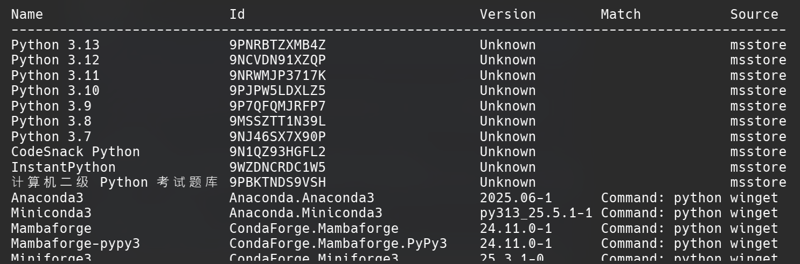

Hello Readers, this is my backup for the very first Python courses that I have taken online, So I wanted to share it with everyone. Below are the resources that will help you in guiding the python journey : From setting up your machine to installing python to writing your very first code. Hope you learn all the basics that are needed to be proficient with python. Good Luck !

# Installing Python on Windows :
---
There are various number of ways to install python below here are listed 3 of them


## from Command Line:

If youre using windows 10 or above, then 

> 1. Open CMD/Powersehell _(in Administrator mode)_
> 2. use winget to install **Python** in latest version

```powerhsell

winget search python      # Winget searches for 'Python' package

```

**Your results will look something like this . . .**




## from Microsoft Store:

Go to Microsoft Store, then search for Python, and download whatever the latest version of python you can find


## from Official Python website:

go to [[https://www.python.org/]] website and download and install Python for your system. 

[!:Caution:] While on installation, make sure to add python in your current **System Path**
